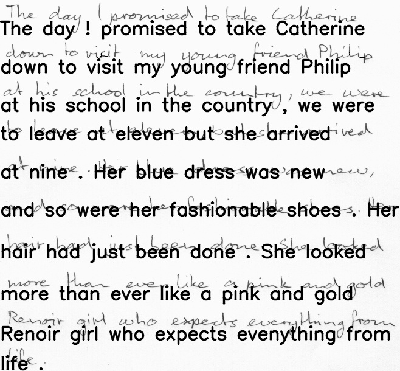

# HANDWRITING RECOGNITION

This app uses Neural Networks to detect and recognize handwritten text in given images.
<div>



</div>

## Installation Instructions
---
### Prerequisite
1. Python3
2. Node.js and npm
  * Ubuntu:
    ```
    sudo apt install nodejs npm
    ``` 
  * MacOs: install homebrew first
    ```
    /usr/bin/ruby -e "$(curl -fsSL https://raw.githubusercontent.com/Homebrew/install/master/install)" 
    brew install node npm
    ```
3. For Mac on Apple silicon, install tensorflow using [this guide](https://caffeinedev.medium.com/how-to-install-tensorflow-on-m1-mac-8e9b91d93706)
### Inint virtual env and install python requirements
```
source venv/bin/activate
pip3 install -r requirements.txt
```
### Start server
```
python3 server/run_server.py
```
### Start client
In another terminal, run
```
cd client 
expo start
cd ..
```
<br>
## App flow
---
<div>

</div>

The user will upload an image with handwritten text to the mobile app, the image will be sent to a remote server. There, the image will be passed through a segmentation function that will extract the lines into separate small images, which then will be passed one-by-one through an RNN that will recognize the text in the image and will output a string. The original image will be processed by adding the readable text and will be sent back to the client-side together with the separate string of text.

<br>
## Server-side
---
On server-side, there are 2 main steps for text extraction: Text Segmentation and Text Recognition.

### Text Segmentation
For text segmentation (aka detection of bounding boxes of individual lines and their extraction) I tried only one method so far: gaussian blur + finding contours. Another method would be to use horizontal projection and ROI detection with R-CNN, the latter being more promising than the first.

#### Gaussian blur + finding contours
This method applies a gaussian blur kernel on the image to make it easier to extract contours and then extract them. The contours being the text lines themselves.

<div style="background-color: red">
TO DO : add examples and elaborate
</div>

#### Horizontal projection
<div style="background-color: red">
blah blah blah
</div>

#### R-CNN and Regions of Interest
<div style="background-color: red">
blah blah blah
</div>
<br>
### Text Recognition
<div style="background-color: red">
blah blah blah
</div>

<br/>

## Client-Side
<div style="background-color: red">
blah blah blah
</div>